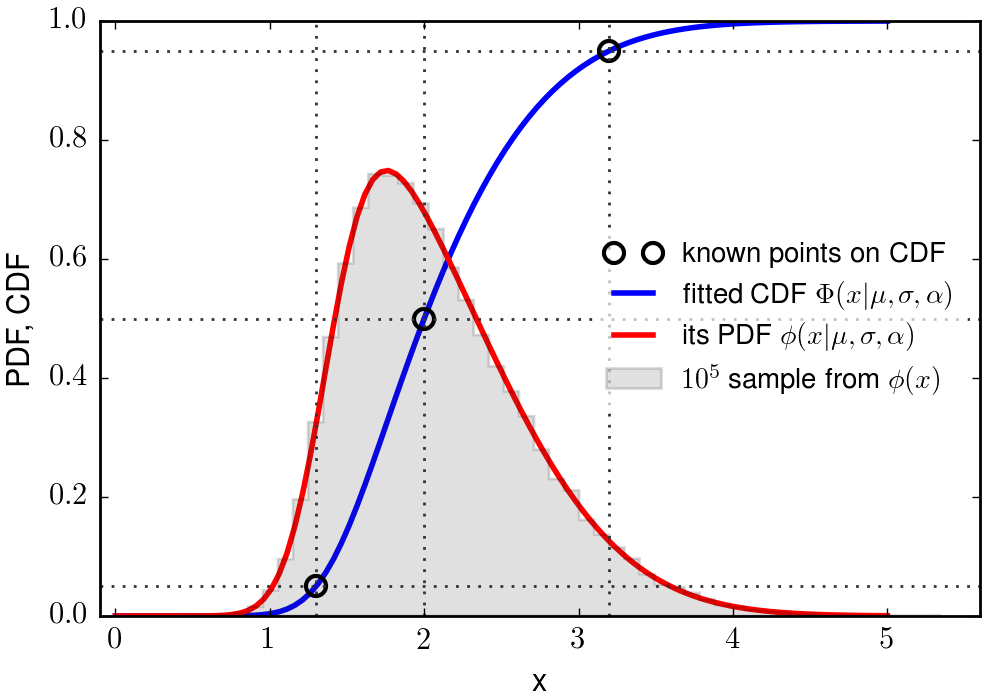

skewnormal
==========

**Author:** Robert Nikutta

**Version:** 2015-04-18

**License:** BSD 3-clause, please see [LICENSE](./LICENSE) file

Estimate the free parameters (mu,sigma,alpha) of a Skew-Normal PDF
when only the location and (possibly asymmetric) spread of a sample
drawn from that PDF are known. Also provides a PyMC sampling object to
draw random variates from the estimated Skew-Normal PDF. Includes all
required helper functions, e.g. **Owen's T function**. See docstring
of classes and funcs for usage.

Run function `plot_skewnorm()` in [example.py](./example.py) to see an
example of how it all works (it generates a PDF figure, a PNG version
of which you can see above).
